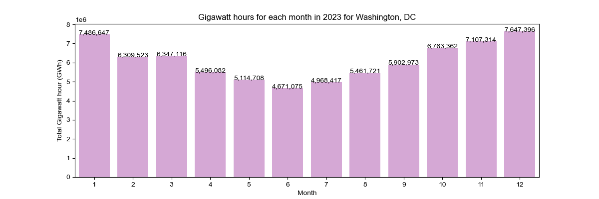
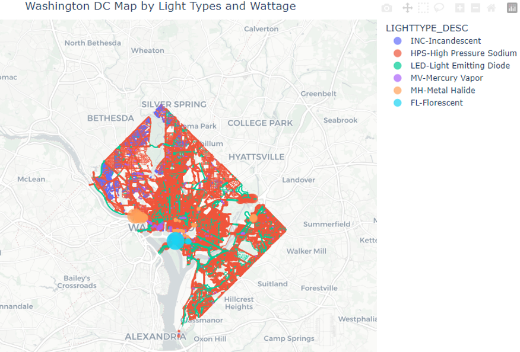

### Project3-Group2

# District of Columbia Street Lights Analysis

## 1. Overview

Get ready to embark on an electrifying journey through the bustling streets of Washington, DC! Our groundbreaking project is revolutionising the way we understand and harness the power of streetlights. Picture this: a dynamic analysis of utility usage and energy consumption, all focused on those iconic streetlights that illuminate one of the World’s most important capitals.

This isn't just about shedding light on energy consumption; it's about empowering utility suppliers to supercharge their planning process. We're talking about a game-changing approach that maps out the very DNA of streetlight infrastructure. Imagine having a treasure trove of data at your fingertips, revealing everything from light types to energy consumption to the precise geolocation of each and every pole.

With the wealth of comprehensive insights provided by our project, companies can unlock a new era of efficiency in their operations. Think about it: optimising budgets for supply and replacement, strategically deploying expert teams based on geographical nuances, and crafting human resources strategies that adapt seamlessly to peak and off-peak periods.

As you delve into the depths of this document, prepare to be dazzled by the step-by-step instructions that will guide you through a thrilling exploration of the wealth of data available within this project. Get ready for insights that will unlock the full potential of streetlight management.

## 2. Resources

- PostgreSQL
- Python
- VS Code
- Jupyter Notebook

### Required Python Libraries

- CSV
- Matplotlib
- Pandas
- Pathlib
- SQLAlchemy
- Warnings

### ‘New’ Libraries (not used before in class)

- [Ipywidgets](https://github.com/jupyter-widgets/ipywidgets#readme) – a Python library used to create interactive widgets. It was used to add user interaction to the pie chart with a dropdown menu and a slider.
- [Seaborn](https://seaborn.pydata.org) – a Python data visualisation library based on matplotlib. It provides a high-level interface for drawing attractive and informative statistical graphics. This library was used to generate the bar chart.

## 3. Instructions

This work was based on two primary sources of information: a CSV file downloaded from the Open Data DC website and a CSV file produced from web scraping techniques applied to a webpage from the US Navy website. Both websites are detailed in the references sections further down this document. The required CSV files resulting from the extraction and transformation stages are available in the relevant folder.

To reproduce this project and navigate accordingly, please follow the steps below in the order they are presented:

1. Create a new SQL Database in PostgreSQL.
2. Create the tables in your new database using the createSchema.sql file from the SQL Files folder.
3. Import the following CSV files:
   a. dates.csv to the dates table
   b. filteredDF.csv to the lights table
4. Run the _Visualisation.ipynb_ file using your preferred IDE. For this project, we used VS Code and Jupyter Notebook.

The _Visualisation.ipynb_ file connects to the SQL database. You must provide your username, password and port of the PostgreSQL server.

Once it is successfully connected, the code will generate three visualisations, being:

**a) Bar chart**

This is a static visualisation based on 2023 daylight and darkness times.

**b) Interactive map**

It allows you to navigate all of the District of Columbia’s street light types.

**c) Interactive pie chart**

This chart contains a dropdown button to select specific streets from the District of Columbia and retrieves the composition of the street lights type from the selection. It also includes a slider command that permits the user to enlarge or shrink the chart’s size for better visualisation.

## 4. Ethical Considerations

- **Legal and ethical considerations**

  What we consider before starting the project:

  1. Open and public sources without copy rights;
  2. Transparency；
  3. Legal compliance;
  4. Data quality: credibility, accuracy and integrity;
  5. Unbiased data.

  Therefore we have decided to acquire data from US government authorities, primarily focusing on three resources:

  - Open Data DC.
  - Astronomical Applications Department
  - US Naval Observatory

  We attempted to acquire data from various sources to mitigate the risks of data bias.

## 5. Data Sources

This project utilises information from the following sources:

- Open Data DC. (2024, April 3). Street Lights. Government of the District of Columbia. <https://opendata.dc.gov/datasets/6cb6520725b0489d9a209a337818fad1_90/explore?location=38.894873%2C-77.022089%2C15.00 >.
- Astronomical Applications Department. (n.d.). Duration of Daylight/Darkness Table for One Year (Washington, DC). United States Navy. < https://aa.usno.navy.mil/calculated/durdaydark?year=2023&task=1&lat=38.89&lon=-77.03&label=Washington%2C+DC&tz=5&tz_sign=-1&submit=Get+Data >.

## 6. Other References

To complete this project, our group sought assistance from the following:

## References:

**Adelaide University AI**

- **Seaborn**  
  Barplot - https://seaborn.pydata.org/generated/seaborn.barplot.html

- **Seaborn Colours** –
  https://medium.com/swlh/how-to-create-a-seaborn-palette-that-highlights-maximum-value-f614aecd706b

- **COMMAS ON GRAPH**
  https://www.geeksforgeeks.org/print-number-commas-1000-separators-python/

      ![alt text][def2]

- **OpenAI. (2024). ChatGPT.**  
  Retrieved April 11, 2024 from https://openai.com/chatgpt
  ![alt text][def] https://openai.com/chatgpt

Get instant answers, find creative inspiration, learn something new.
![alt text][def3]

- **OpenData DC. (2024). **
  Streetlight Locations.\*\*  
  Retrieved April 4, 2024, from https://opendata.dc.gov/datasets/6cb6520725b0489d9a209a337818fad1_90/explore?location=38.894874%2C-77.022089%2C15.00

- **Perchance. (2024). AI Text-to-Image Generator.**  
  Retrieved April 13, 2024, from https://perchance.org/ai-text-to-image-generator
- **Plotly. (2024). Mapbox Density Heatmaps.**  
  Retrieved April 9, 2024, from https://plotly.com/python/mapbox-density-heatmaps/
- **U.S. Naval Observatory. (2023). Daylight Duration for Washington, DC.**  
  Retrieved April 4, 2024 from https://aa.usno.navy.mil/calculated/durdaydark?year=2023&task=1&lat=38.89&lon=-77.03&label=Washington%2C+DC&tz=5&tz_sign=-1&submit=Get+Data

- **opendata.dc.gov**

  **Street Lights**
  This data is used for the planning and management of Street Lights - Assets, Activities, Incidents, as well as the maintenance of Street Light Features of the District Department of Transportation (DDOT).

- **perchance.org**

  **AI Image Generator (free, no sign-up, unlimited)**
  AI text to image generator. Generate AI art from text, completely free, online, no login or sign-up, no daily credit limits/restrictions/gimmicks, and it's fast. Other AI art generators have annoying daily credit limits and require sign-up, or are slow - this one doesn't. Use this AI to generate high quality art, photos, cartoons, drawings, anime, thumbnails, pfps, and more. Create OCs, anime characters, sexy AI villains, fanfic artwork, and pretty much anything else. It's an AI-based image generator that uses the Stable Diffusion text-to-image model. No watermark, no signup/login, unlimited images. Type words, make pics.
  

- **plotly.com**

  **Mapbox**
  Detailed examples of Mapbox Density Heatmap including changing color, size, log axes, and more in Python.

- **MediumMedium**

  **How to Create a Seaborn Palette That Highlights Maximum Value**
  While working on my latest data science project, I realized I needed a way to quickly highlight the maximum value in each of my…
  Reading time
  4 min read
  Dec 9th, 2020

  https://medium.com/swlh/how-to-create-a-seaborn-palette-that-highlights-maximum-value-f614aecd706b

  

- **GeeksforGeeks**

  **Print number with commas as 1000 separators in Python - GeeksforGeeks**

  A Computer Science portal for geeks. It contains well written, well thought and well explained computer science and programming articles, quizzes and practice/competitive programming/company interview Questions.

[def]: image-1.png
[def2]: image.png
[def3]: image-2.png
